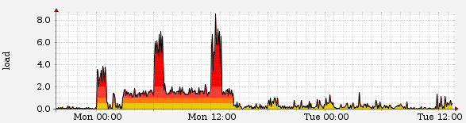

Jobq
====

Simple job queue management (a better 'batch')
----------------------------------------------

* See [http://deb.bearstech.com/] for Debian packages

**jobq** manages a simple batch queue, where one job is run after the other.
Many queues can be run independently, and no specific privileges or
daemon is required. Queue info and statistics are syslogged.

It is especially useful for complex crontabs, to force sequential
execution of jobs that would otherwise run in parallel with unlimited
instances. Jobs and load can be regulated by 'run queues' very easily
with **jobq**.

**jobq** is licensed under the [GNU GPL 3.0](http://www.gnu.org/licenses/gpl.html).

Example usage
-------------

Run two heavy jobs: first one is run immediatly since queue
is initially empty (shows in processes but not in queue), the second one
is waiting (shows in queue).

    hal:~$ jobq heavy_job arg1
    hal:~$ jobq heavy_job arg2 param2
    
    hal:~$ pgrep -lf heavy_job
    10441 /usr/bin/heavy_job arg1
    
    hal:~$ jobq
    ID     Submission date      Command
    10447  2009-10-27 16:06:59  heavy_job arg2 param2
    
    hal:~$ tail /var/log/user.log
    Oct 27 16:06:52 hal jobq: queue runner started for user/queue 'foo/default' (pid 10421)
    Oct 27 16:06:52 hal job[foo/default/10413]: start (delay:0 sec, todo:0): heavy_job arg1
    Oct 27 16:07:22 hal job[foo/default/10413]: done (time:30 sec, exit:0)
    Oct 27 16:07:22 hal job[foo/default/10447]: start (delay:23 sec, todo:0): heavy_job arg2 param2
    Oct 27 16:07:27 hal job[foo/default/10447]: done (time:5 sec, exit:0)

First job was scheduled and started at 16:06:52 and took 30 sec to complete.

Second job was scheduled 7 seconds later at 16:06:59 (not logged), started at
16:07:22 (23 sec after sheduling) and took 5 sec to complete.

Job queue monitoring
--------------------

**jobq-profile** prints time and calls per script:

    $ jobq-profile -q production
    
    Calls  Time(sec)  Command
       12     460504  ./script/runner "LivePush.clean" && ./script/pates 
      197      49165  rake -s import:foobar:home_news_competition
      201      35767  rake -s import:foobar:news
      492       3063  rake -s import:foobar:update_recent_game_squad
       [...]

**jobq-stat** compile some statistics from logged timings and give you an overview of your queue health (it calls ''jobq-profile''):

    $ jobq-stat -q production
    
    Current job queue size  : 6 pending jobs
    Oldest queued job posted: 4 minute(s) ago
    
    Job execution statistics from 'Apr 12 16:50:02' to 'Apr 16 17:39:25'
    (extracted from /var/log/user.log):
    
      Total jobs launched   : 4300
      Average job queue size: 170
      Maximum job queue size: 1817
      Average job delay     : 77 minute(s)
      Maximum job delay     : 846 minute()s
      Longest job exec time : 43779 second(s)
      Longest job command   : ./script/runner "LivePush.clean" && ./script/pates
    
    Calls  Time(sec)  Command
       12     460504  ./script/runner "LivePush.clean" && ./script/pates 
      197      49165  rake -s import:foobar:home_news_competition
      201      35767  rake -s import:foobar:news
      492       3063  rake -s import:foobar:update_recent_game_squad
      489       3035  rake -s import:foobar:update_recent_game_information
      489       2949  rake -s import:foobar:update_ranking_just_after_game
      197       1864  rake -s import:foobar:home_news
       65        867  rake thinking_sphinx:index > /dev/null 2>&1 
        3         16  ./script/runner "LivePush.clean" 
        2         16  rake -s import:foobar:update_recent_end_game_squad
        2         16  rake -s import:foobar:update_ranking_during_one_day
        2         15  rake -s import:foobar:update_recent_end_game_information
    
    Pending jobs:
      ID     Submission date      Command
      29092  2010-04-16 17:35:01  rake -s import:foobar:home_news 
      29791  2010-04-16 17:36:01  rake -s import:foobar:update_ranking_just_after_game 
      29790  2010-04-16 17:36:01  rake -s import:foobar:update_recent_game_information 
      29788  2010-04-16 17:36:01  rake -s import:foobar:update_recent_game_squad 
      30842  2010-04-16 17:38:01  rake -s import:foobar:update_ranking_just_after_game 
      30841  2010-04-16 17:38:01  rake -s import:foobar:update_recent_game_information 

Real life sample
----------------

The following picture is a 'load graph' from a server with a large crontab, launching many jobs at different frequency, from every minute to every month. Of course, sometimes jobs overlap badly, and if they compete for a scarce ressource (such as I/O on a local disk) they are slow and also slow down the whole server. Those load graphs often exhibits horizontal "plateaus" close to integer values, a sign that you have long running processes which stack up and eat all your server ressources.

On Tuesday all jobs where run through a single queue by simply prepending 'jobq' to the existing commands in the crontab. The server was running smoothly again, and the problem was now a safer one where the job queue has to be monitored for not growing indefinitely, searching for possible job parallelism and carefully creating new independent job queues.
